```{r setup, include=FALSE}
knitr::opts_chunk$set(echo = TRUE, 
                      fig.align = "center",
                      fig.pos = 'H')
```

## 1-) Objetivo:

* Montar um perfil dos clientes segundo seu sexo.  
* Avalar o perfil dos clientes co conta bancária em relação à satisfação com o limite de crédito desponível.

## 2-) Metodologia:

<p>Foi realizados os seguintes testes para responder os objetivos desse relatório Qui-Quadrado, Teste de Hipóteses para Média, Teste de Hipóteses para Variância e Teste de Kolmogorov-Smirnov usando um nível de significância de 10% ($\alpha$=10%). Para a análise e confecção desse relatório foram avaliadas somente algumas variáveis que foram consideradas de interesse para responder as perguntas 1 e 2.</p> 
	
## 3-) Análise dos Resultados:

<p>Com base nos resultados da base de dados, no nível de significância (estabelecido na seção anterior) e usando os testes e análises descritivas adequados, para cada situação, podemos concluímos para o **1º objetivo** que:</p>

  * Utilizando o teste Qui-Quadrado podemos dizer que as variáveis “Banco” e “Satisfeito com o limite” são independentes (usando o p-valor da tabela \ref{table:tab1}).
  * Primeiro temos que pelo teste de Kolmogorov-Smirnov que as amostras possuem distribuição normal para o nível de significância de 10%,  temos também que pelo t-test que a média de idade das pessoas não satisfeitas com o limite oferecido é maior do as que estão satisfeitas com seu limite (p-valor=0.1445>$\alpha$).
  *	Utilizando o teste Qui-Quadrado podemos dizer que as variáveis “Banco” e “Satisfeito com o limite” são independentes (usando o p-valor da tabela \ref{table:tab1}).
  
  **2º objetivo:**
  
  *	Para analisarmos as variáveis “Tempo que é cliente” e “Satisfeito com o limite” estamos considerando que temos normalidade assintótica, nesse cenário podemos dizer que a média de idade de quem é satisfeito com o limite é maior do quem não é satisfeito (p-valor=0.01669<$\alpha$).
 *	Utilizando o teste Qui-Quadrado podemos dizer que as variáveis “Falou com gerente” e “Satisfeito com o limite” são independentes (usando o p-valor da tabela \ref{table:tab1}).
 *	Utilizando o teste Qui-Quadrado podemos dizer que as variáveis “sexo” e “Satisfeito com o limite” são dependentes (usando o p-valor da tabela \ref{table:tab1}).

\pagebreak

## 4-) Conclusão:

<p>Verificamos, seção anterior, que há uma relação entre as variáveis “sexo” e “possuir nome no SERASA”, utilizando a analise descritiva na \ref{table:tab2} temos evidências que dos possuem nome no SERASA a maioria (64.9%) são homens já as mulheres estão em minoria com 35.1%. Por outro lado, os homens são os mais satisfeitos com o limite da conta, acreditamos que o limite oferecido aos homens é incompatível com a situação de inadimplência. Sendo assim, seria mais adequado reduzir o limite dos homens e  oferecer para a mulher não inadimplentes um limite maior.</p>   
<p>Pensando quanto a satisfação dos clientes em relação limite oferecido podemos afirmar que os clientes do Bradesco são proporcionalmente mais satisfeitos com limite oferecido (80%), já a Caixa possui a maior porcentagem de insatisfação dos clientes com o limite.</p>   
<p>Usando os teste adequado, a tabela \ref{table:tab2} e um boxplot gráfico ,presente no apêndice, podemos dizer que o tempo de uso semanal do Bankline aumentou para quem fez o curso. Portanto, suspeitamos que o curso incentivou o usuário usar mais os serviço disponíveis no Bankline sendo assim o curso foi efetivo.</p>

\pagebreak 

## 5-)Apêndice:

### 5.1-) Figuras:

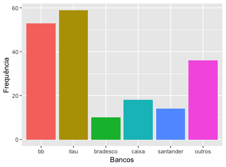{ width=300px } 

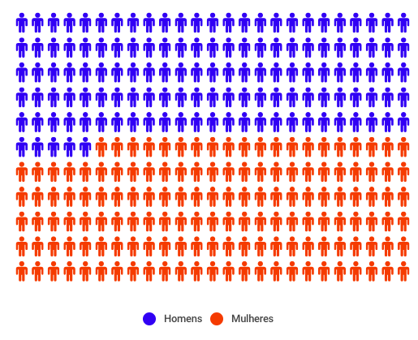{ width=300px }

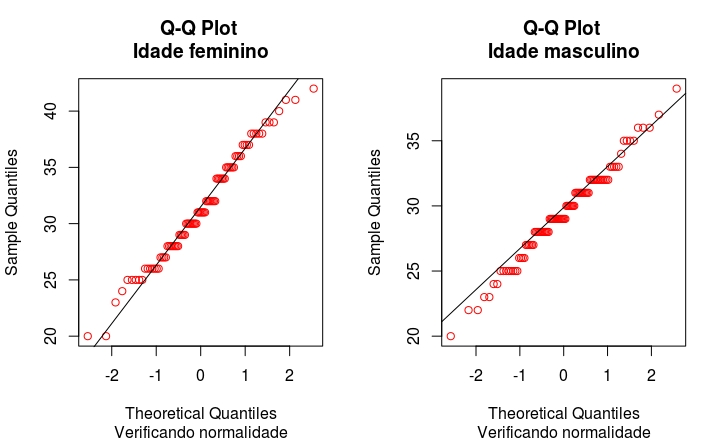{ width=300px }
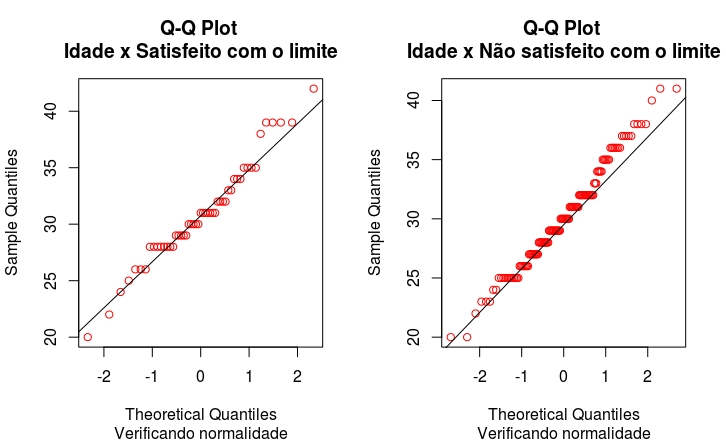{ width=300px }

{ width=300px }
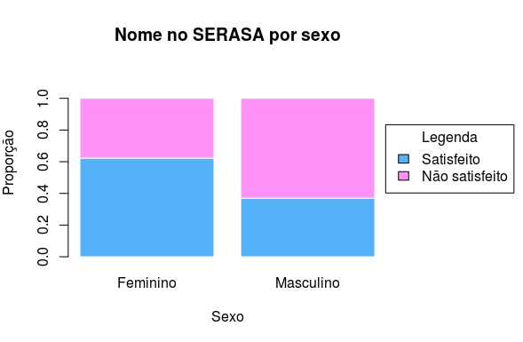{ width=300px }

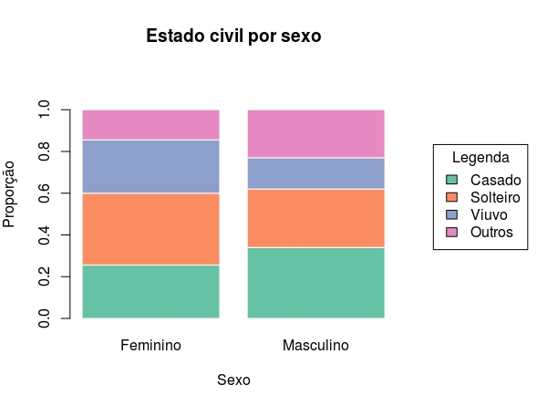{ width=300px }
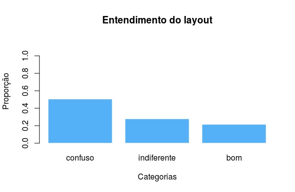{ width=300px }

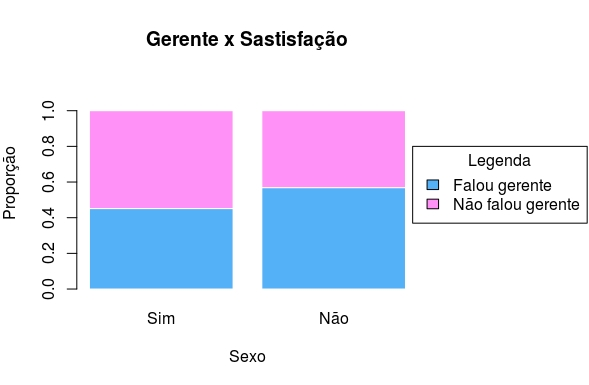{ width=300px }
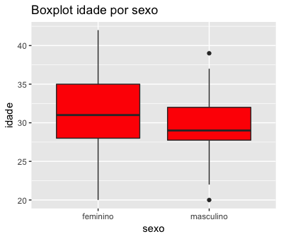{ width=300px }
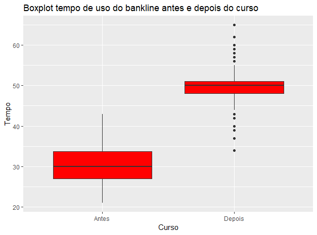{ width=300px }
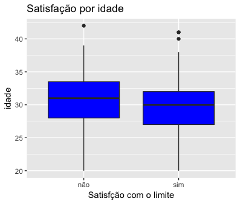{ width=300px }
\pagebreak 

### 5.2-) Tabelas:

\begin{table*}[h!]
    \centering
        \caption{Tabela de contigência com p-valor}
        \begin{tabular}{c c c c c c c c c}
            \toprule
            \midrule
                & & \multicolumn{4}{c}{Sexo}\\ \cmidrule{3-9}
                && \multicolumn{2}{c}{Masculino} & \multicolumn{2}{c}{Feminino} & \multicolumn{2}{c}{Total} \\ \cmidrule{3-9}
                && n & \% & n & \% & n & \% & P-Valor \\ \cmidrule{3-9}
                \multicolumn{1}{c}{\multirow{5}{*}}   &
                \multicolumn{1}{l}{\textbf{SERASA}} &  &  &  & & &  & \textcolor{red}{0.0005155} \\ \cmidrule{1-9}
                \multicolumn{1}{c}{}    &
                \multicolumn{1}{l}{Não} & 37 & 39.8 & 56 & 60.2 & 93 & 48.9 &  \\
                \multicolumn{1}{c}{}    &
                \multicolumn{1}{l}{Sim}& 63 & 64.9 & 34 & 35.1 & 97 & 51.1  \\ \cmidrule{1-9} &
                \multicolumn{1}{l}{\textbf{Estado Civil}} &  &  &  & & &  & 0.1882 \\ \cmidrule{1-9}                
                \multicolumn{1}{c}{}    &
                \multicolumn{1}{l}{Casado} & 34 & 40.4 & 23 & 59.6 & 57 & 30 &  \\
                \multicolumn{1}{c}{}    &   
                \multicolumn{1}{l}{Solteiro} & 28 & 52.5 & 31 & 47.5 & 59 & 31.1 &  \\
                \multicolumn{1}{c}{}    &
                \multicolumn{1}{l}{Viúvo} & 15 & 60.5 & 23 & 39.5 & 38 & 20   \\
                \multicolumn{1}{c}{}    &
                \multicolumn{1}{l}{Outros} & 23 & 36.1 & 13 & 63.9& 36 & 18.9   \\  
                \toprule
                \midrule 
                & & \multicolumn{4}{c}{Satisfeito com limite}\\ \cmidrule{3-9}
                && \multicolumn{2}{c}{Não} & \multicolumn{2}{c}{Sim} & \multicolumn{2}{c}{Total}  \\ \cmidrule{3-9}
                && n & \% & n & \% & n & \% & P-Valor \\ \cmidrule{3-9}
                \multicolumn{1}{c}{\multirow{5}{*}}   &
                \multicolumn{1}{l}{\textbf{SERASA}} &  &  &  & & &  & 0.5203 \\ \cmidrule{1-9}
                \multicolumn{1}{c}{}    &
                \multicolumn{1}{l}{Não} & 23 & 24.7 & 70 & 75.3 & 93 & 48.9 &  \\
                \multicolumn{1}{c}{}    &
                \multicolumn{1}{l}{Sim}& 28 & 28.9 & 69 & 71.1 & 97 & 51.1 \\ \cmidrule{1-9} &
                \multicolumn{1}{l}{\textbf{Banco}}&  &  &  & & &  & 0.1366\\ \cmidrule{1-9}                
                \multicolumn{1}{c}{}    &
                \multicolumn{1}{l}{BB} & 17 & 32.1 & 36 & 67.9 & 53 & 27.9  \\
                \multicolumn{1}{c}{}    &   
                \multicolumn{1}{l}{Itaú} &16 & 27.1 & 43 & 72.9 & 59 & 31.1  \\
                \multicolumn{1}{c}{}    &
                \multicolumn{1}{l}{Bradesco} & 2 & 20 & 8 & 80 & 10 & 5.3 \\
                \multicolumn{1}{c}{}    &
                \multicolumn{1}{l}{Caixa} & 8 & 44.1 & 10 & 55.9 & 36 & 18.9  \\
                \multicolumn{1}{c}{}    &
                \multicolumn{1}{l}{Santander} & 4 & 28.6 & 10 & 71.4 & 14 & 7.4  \\
                \multicolumn{1}{c}{}    &
                \multicolumn{1}{l}{Outros} & 4 & 11.1 & 32 & 88.9  & 36 & 18.9\\ \cmidrule{1-9} &
                \multicolumn{1}{l}{\textbf{Gerente}} &   &  &  & & &  & 0.1505 \\ \cmidrule{1-9}
                \multicolumn{1}{c}{}    &
                \multicolumn{1}{l}{Não} & 28 & 31.8 & 60 & 68.2 & 88 & 48.9 &  \\
                \multicolumn{1}{c}{}    &
                \multicolumn{1}{l}{Sim}& 23 & 22.5 & 79 & 77.5 & 102 & 51.1  \\ \cmidrule{1-9} &
                \multicolumn{1}{l}{\textbf{Sexo}} &   &  &  & & &  & \textcolor{red}{0.001251} \\ \cmidrule{1-9}
                \multicolumn{1}{c}{}    &
                \multicolumn{1}{l}{Feminino} & 34 & 37.8 & 56 & 62.2 & 90 & 47.4 &  \\
                \multicolumn{1}{c}{}    &
                \multicolumn{1}{l}{Masculino}& 17 & 17 & 79 & 83 & 83 & 52.6  \\
                \midrule
                \bottomrule
        \end{tabular}
        \centering
        \label{table:tab1}
        \label{tab:sam_count}
\end{table*}

\begin{table}[h!]
  \begin{center}
  \caption{Tabela com algumas medidas resumo}
    \begin{tabular}{c|c|c|c|c|c|c|c}
    \hline
      \textbf{Variável} & \textbf{Min} & \textbf{Max} & \textbf{1º Q} & \textbf{2º Q} & \textbf{3º Q} & \textbf{Média}  & \textbf{Desvio Padrão} \\
      \hline
      Idade & 20 & 42 & 28 & 30 & 32.75 & 30.37 & 4.3\\
      Tempo de uso do Bankline antes do curso & 21 & 43 & 27 & 30 & 33.75 & 30.28 & 4.53\\
      Tempo de uso do Bankline depois do curso & 34 & 65 & 48 & 50 & 51 & 49.92 & 3.87 \\ 
      \hline
    \end{tabular}
     \label{table:tab2}
  \end{center}
\end{table}