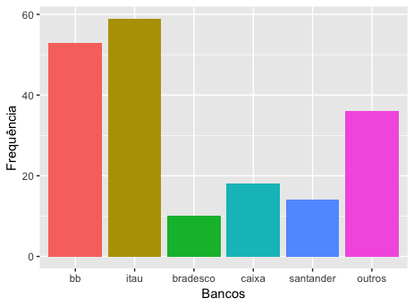
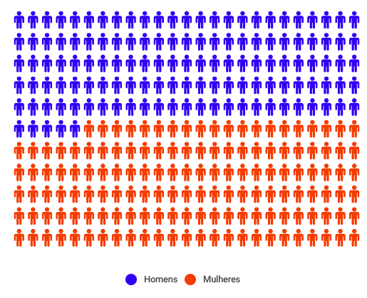
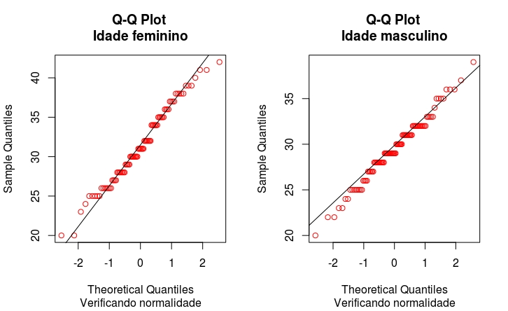
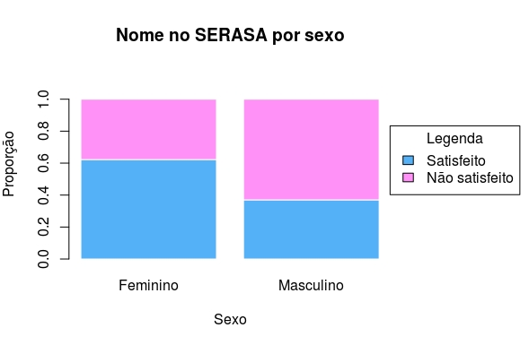
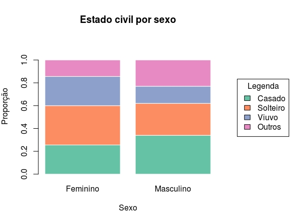
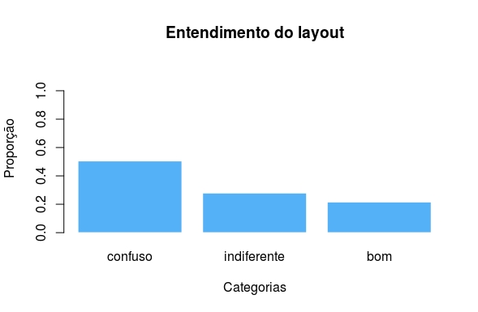
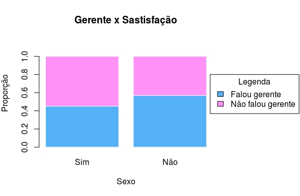

```{r setup, include=FALSE}
knitr::opts_chunk$set(echo = TRUE, 
                      fig.align = "center",
                      fig.pos = 'H')
```

## 1-) Objetivo:

* Montar um perfil dos clientes segundo seu sexo.  
* Avalar o perfil dos clientes co conta bancária em relação à satisfação com o limite de crédito desponível.

## 2-) Metodologia:

Foi realizados os seguintes testes para responder os objetivos desse relatório Qui-Quadrado, Teste de Hipóteses para Média, Teste de Hipóteses para Variância e Teste de Kolmogorov-Smirnov usando um nível de significância de 10% ($\alpha$=10%). Para a análise e confecção desse relatório foram avaliadas somente algumas variáveis que foram consideradas de interesse para responder as perguntas 1 e 2. 
	
## 3-) Análise dos Resultados:

  Com base em nos resultados da base de dados, no nível de significância (estabelecido na seção anterior) e usando os teste e análises adequados, para cada situação, podemos concluir que a média de idade dos homens descritivas é maior do as das mulheres (p-valor=0.9989>$\alpha$), também podemos ver que 17.9%  das pessoas que possuem nome são mulheres e baseado no teste Qui-Quadrado podemos dizer que a variável sexo e possuir nome no SERASA são dependentes (pois p-valor=0.0005155<$\alpha$)  

## 4-) Conclusão:

## 5-)Apêndice:

### 5.1-) Figuras:

{ width=300px } 
{ width=300px }

{ width=300px }
{ width=300px }

{ width=300px }
{ width=300px }

{ width=300px }
{ width=300px }

{ width=300px }


### 5.2-) Tabelas:

\begin{table*}[t!]
    \centering
        \begin{tabular}{c c c c c c c c c}
            \toprule
            \midrule
                & & \multicolumn{4}{c}{Sexo}\\ \cmidrule{3-9}
                && \multicolumn{2}{c}{Masculino} & \multicolumn{2}{c}{Feminino} & \multicolumn{2}{c}{Total} \\ \cmidrule{3-9}
                && n & \% & n & \% & n & \% & P-Valor \\ \cmidrule{3-9}
                \multicolumn{1}{c}{\multirow{5}{*}}   &
                \multicolumn{1}{l}{\textbf{SERASA}} &  &  &  & & &  & 0.0005155 \\ \cmidrule{1-9}
                \multicolumn{1}{c}{}    &
                \multicolumn{1}{l}{Não} & 37 & 39.8 & 56 & 60.2 & 93 & 48.9 &  \\
                \multicolumn{1}{c}{}    &
                \multicolumn{1}{l}{Sim}& 63 & 64.9 & 34 & 35.1 & 97 & 51.1  \\ \cmidrule{1-9} &
                \multicolumn{1}{l}{\textbf{Estado Civil}} &  &  &  & & &  & 0.1882 \\ \cmidrule{1-9}                
                \multicolumn{1}{c}{}    &
                \multicolumn{1}{l}{Casado} & 34 & 40.4 & 23 & 59.6 & 57 & 30 &  \\
                \multicolumn{1}{c}{}    &   
                \multicolumn{1}{l}{Solteiro} & 28 & 52.5 & 31 & 47.5 & 59 & 31.1 &  \\
                \multicolumn{1}{c}{}    &
                \multicolumn{1}{l}{Viúvo} & 15 & 60.5 & 23 & 39.5 & 38 & 20   \\
                \multicolumn{1}{c}{}    &
                \multicolumn{1}{l}{Outros} & 23 & 36.1 & 13 & 63.9& 36 & 18.9   \\  
                \toprule
                \midrule 
                & & \multicolumn{4}{c}{Satisfeito com limite}\\ \cmidrule{3-9}
                && \multicolumn{2}{c}{Não} & \multicolumn{2}{c}{Sim} & \multicolumn{2}{c}{Total}  \\ \cmidrule{3-9}
                && n & \% & n & \% & n & \% & P-Valor \\ \cmidrule{3-9}
                \multicolumn{1}{c}{\multirow{5}{*}}   &
                \multicolumn{1}{l}{\textbf{SERASA}} &  &  &  & & &  & 0.5203 \\ \cmidrule{1-9}
                \multicolumn{1}{c}{}    &
                \multicolumn{1}{l}{Não} & 23 & 24.7 & 28 & 28.9 & 51 & 26.8 &  \\
                \multicolumn{1}{c}{}    &
                \multicolumn{1}{l}{Sim}& 70 & 50.4 & 69 & 49.6 & 136 & 75.2  \\ \cmidrule{1-9} &
                \multicolumn{1}{l}{\textbf{Banco}}&  &  &  & & &  & 0.1366\\ \cmidrule{1-9}                
                \multicolumn{1}{c}{}    &
                \multicolumn{1}{l}{BB} & 17 & 32.1 & 36 & 67.9 & 53 & 27.9  \\
                \multicolumn{1}{c}{}    &   
                \multicolumn{1}{l}{Itaú} &16 & 27.1 & 43 & 72.9 & 59 & 31.1  \\
                \multicolumn{1}{c}{}    &
                \multicolumn{1}{l}{Bradesco} & 2 & 20 & 8 & 80 & 10 & 5.3 \\
                \multicolumn{1}{c}{}    &
                \multicolumn{1}{l}{Caixa} & 8 & 44.1 & 10 & 55.9 & 36 & 18.9  \\
                \multicolumn{1}{c}{}    &
                \multicolumn{1}{l}{Santander} & 4 & 28.6 & 10 & 71.4 & 14 & 7.4  \\
                \multicolumn{1}{c}{}    &
                \multicolumn{1}{l}{Outros} & 4 & 11.1 & 32 & 88.9  & 36 & 18.9\\ \cmidrule{1-9} &
                \multicolumn{1}{l}{\textbf{Gerente}} &   &  &  & & &  & 0.1505 \\ \cmidrule{1-9}
                \multicolumn{1}{c}{}    &
                \multicolumn{1}{l}{Não} & 28 & 31.8 & 60 & 68.2 & 88 & 48.9 &  \\
                \multicolumn{1}{c}{}    &
                \multicolumn{1}{l}{Sim}& 23 & 22.5 & 79 & 77.5 & 102  \\
                \midrule
                \bottomrule
        \end{tabular}
        \centering
        \caption{Tabela de contigência com p-valor}
        \label{table:tab1}
        \label{tab:sam_count}
\end{table*}

\begin{table}[h!]
  \begin{center}
    \begin{tabular}{c|c|c|c|c|c|c|c}
    \hline
      \textbf{Variável} & \textbf{Min} & \textbf{Max} & \textbf{1º Q} & \textbf{2º Q} & \textbf{3º Q} & \textbf{Média}  & \textbf{Desvio Padrão} \\
      \hline
      Idade & 20 & 42 & 28 & 30 & 32.75 & 30.37 & 4.3\\
      Tempo de uso do Bankline antes do curso & 21 & 43 & 27 & 30 & 33.75 & 30.28 & 4.53\\
      Tempo de uso do Bankline depois do curso & 34 & 65 & 48 & 50 & 51 & 49.92 & 3.87 \\ 
      \hline
    \end{tabular}
    \caption{Tabela com algumas medidas resumo}
     \label{table:tab2}
  \end{center}
\end{table}
aaa \ref{table:tab2}